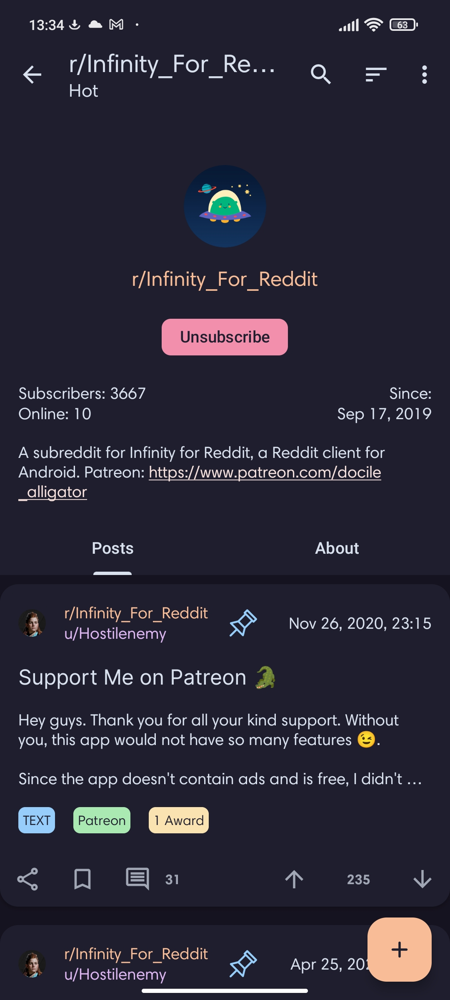

<h3 align="center">
	 
	
	Catppuccin for Infinity for Reddit
	
</h3>

    
    
    

  

## Usage

1. Copy the contents of [this file](catppuccin)
2. Go to Settings > Theme > Manage Theme > Plus Icon > Import Theme
3. Select Catppuccin and Set it as Dark Theme

## 💝 Thanks to

- [Ryan Putrama Yahya](https://github.com/lepz0r)

&nbsp;

